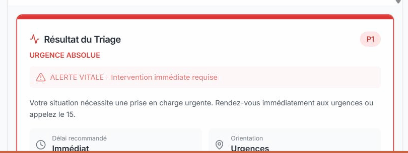
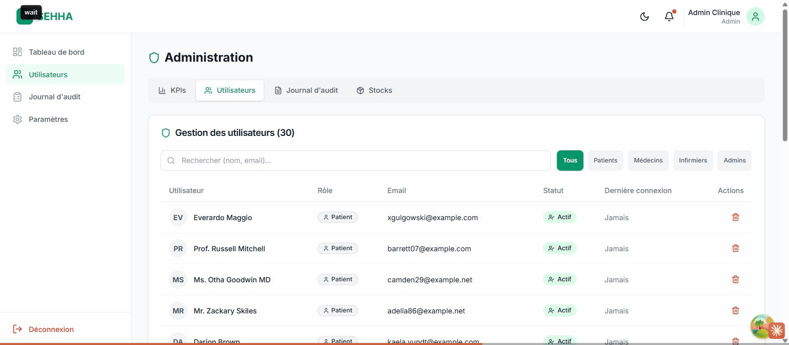

<div align="center">

# SEHHA

**AI-powered medical pre-triage and hospital patient-flow management**


[Demo video](https://example.com/sehha-demo) &nbsp;|&nbsp; [Technical documentation](https://example.com/sehha-doc) &nbsp;|&nbsp; [Live demo](https://example.com/sehha-app)

<sub>Placeholder links, to be completed.</sub>

</div>

---

## Contents

1. [The problem](#the-problem)
2. [The solution](#the-solution)
3. [How it works](#how-it-works)
4. [Features](#features)
5. [Security and compliance](#security-and-compliance)
6. [For developers](#for-developers)
7. [Team](#team)
8. [Roadmap](#roadmap)
9. [License](#license)

---

## The problem

In public hospitals, emergency rooms are overloaded. A large share of the people
who show up do not need urgent care, but without timely guidance they take the
place of the cases that truly do. Waiting time grows for everyone, and the risk
rises for those who cannot wait.

At the same time, the patient's medical record is often on paper. It gets lost,
stays incomplete, or is not available when the caregiver needs it. Every facility
starts over from scratch.

## The solution

SEHHA works on two fronts.

**Before the patient reaches the hospital.** The patient describes how they feel,
in their own words. An assistant asks follow-up questions the way a caregiver
would, then assigns an urgency level, from red (critical) to green (non-urgent).
Critical cases are sent straight to the emergency room. Non-urgent cases are
routed to an appointment.

**During and after care.** The patient's medical record is digital, complete and
secure. Sensitive information stays unreadable if the data is stolen and is shown
in clear only to the authorized caregiver. Every access and every change is
written to a history that cannot be altered or deleted.

The outcome: less crowding in the emergency room, better prioritization of the
serious cases, and continuity of care between professionals.

## How it works

A patient, Mohamed, feels chest pain. He opens the app and describes his
symptoms. The assistant questions him, recognizes the signs of a possible cardiac
emergency, and directs him to the emergency room without an appointment.

On the other side, the doctor receives the alert on screen, instantly. Opening
the record takes more than a password: a second check through a one-time code is
required. The doctor reviews the history, immediately sees that the patient is
allergic to penicillin, writes the consultation and prescribes a treatment. When
the doctor picks a forbidden antibiotic by mistake, the app blocks the
prescription.

The prescription that is issued carries a unique code that cannot be forged. At
the pharmacy, a single scan tells whether it is authentic.

<div align="center">

<table>
<tr>
<td width="50%"></td>
<td width="50%"></td>
</tr>
<tr>
<td align="center"><sub>Urgency assessment</sub></td>
<td align="center"><sub>Caregiver dashboard</sub></td>
</tr>
</table>

**[Watch the demo video (5 min)](https://example.com/sehha-demo)**

<sub>Screenshots and link to be completed.</sub>

</div>

## Features

| Area | What SEHHA does |
|---|---|
| Urgency assessment | AI-guided interview, urgency level from red to green, automatic routing |
| Digital medical record | History, allergies, consultations, vitals, documents, access based on the caregiver's role |
| Forgery-proof prescription | Official document with a control code, verified by scan at the pharmacy |
| Real-time alerts | Serious cases appear on the caregiver's screen without a page refresh, with a sound signal |
| Appointment booking | Online booking for non-urgent cases, in seconds |
| Ward monitoring | Available beds, medication stock, automatic alerts when a stock runs critical |
| Indicators | A synthetic view for the ward manager: occupancy, delays, patient flow |
| Traceability | Tamper-proof history of every access and change to the record |

## Security and compliance

- Two-step identity check for caregivers, through a one-time code.
- Data access strictly limited to each user's role.
- Sensitive data kept unreadable at rest, decrypted only for display to the
  authorized user.
- Tamper-proof action history, across three levels of logging.
- Prescriptions signed with a cryptographic code that cannot be reproduced.
- Designed in line with Moroccan Law 09-08 on the protection of personal data.

---

## For developers

### Architecture

The project is a set of four independent services.

| Service | Role | Technology | Port |
|---|---|---|---|
| `sehha-backendV2` | Main API: authentication, medical record, appointments, prescriptions, administration | Laravel 12, PHP 8.2, PostgreSQL 16 | 8000 |
| `triage-medical` | Urgency assessment engine, conversational interview, severity score | FastAPI, vector knowledge base | 8001 |
| `sehha-ai-server` | Utility services: speech recognition, document reading, local language model | FastAPI, Whisper, PaddleOCR, Mistral | 8002 |
| `sehha-front` | Web interface for the five roles (patient, nurse, doctor, admin, manager) | React 19, Vite, TypeScript | 3000 |

The backend exposes a REST API consumed by the web interface and talks to it in
real time over WebSocket. It calls the two Python services for the AI functions.

### Prerequisites

- PHP 8.2 or newer, Composer
- Node.js 20 or newer
- Python 3.10
- PostgreSQL 16
- Docker (optional, for Redis)
- Ollama (optional, local fallback for the triage engine)

### Local setup

Clone the repository, then copy each `.env.example` file to `.env` and fill in the
values (encryption key, shared tokens, language model key).

```bash
git clone https://example.com/sehha.git
cd sehha
```

**1. Database and backend**

```bash
cd sehha-backendV2
cp .env.example .env          # set DB_*, ENCRYPTION_KEY, tokens
composer install
php artisan key:generate
php artisan migrate:fresh --seed
php artisan serve --port=8000        # API
php artisan reverb:start             # real time, in another terminal
```

**2. Triage engine**

```bash
cd triage-medical
python -m venv venv && venv\Scripts\activate
pip install -r requirements.txt
python scripts/build_kb.py            # builds the knowledge base
uvicorn app.main:app --port 8001
```

**3. AI services** (optional: speech recognition and document reading)

```bash
cd sehha-ai-server
python -m venv venv && venv\Scripts\activate
pip install -r requirements.txt
cp .env.example .env                  # set AI_SERVER_TOKEN
python main.py                        # port 8002
```

**4. Web interface**

```bash
cd sehha-front
cp .env.example .env
npm install
npm run dev                           # http://localhost:3000
```

### Demo accounts

Available after `php artisan migrate:fresh --seed`.

| Role | Login | Password |
|---|---|---|
| Manager | `admin@sehha.ma` | `Admin@123` |
| Doctor | `dr.fatima@sehha.ma` | `Medecin@123` |
| Nurse | `ali.infirmier@sehha.ma` | `Infirmier@123` |
| Patient | `mohamed.elamrani@email.ma` | `Patient@123` |

Caregiver one-time codes are written to
`sehha-backendV2/storage/logs/email.log`.
Shortcut: `php artisan otp:last dr.fatima`.

---

## Team

Built for the Youth Nexus Cyber AI Challenge, ENSA Kenitra.

| Member | Role | GitHub |
|---|---|---|
| First Last | Project lead, backend architecture | [@handle](https://github.com/handle) |
| First Last | Triage engine, artificial intelligence | [@handle](https://github.com/handle) |
| First Last | Web interface | [@handle](https://github.com/handle) |
| First Last | Security and compliance | [@handle](https://github.com/handle) |
| First Last | Data and infrastructure | [@handle](https://github.com/handle) |

<sub>To be completed with real names and handles.</sub>

## Roadmap

- Connect multiple facilities to each other
- Compliance with international standards for medical data exchange
- Mobile application
- Refine the triage engine from field data

## License

To be decided. The MIT license is recommended for an open project.

---

<div align="center">

> Where health is absent, wisdom cannot reveal itself, art cannot become
> manifest, strength cannot be exerted, wealth is useless, and reason is
> powerless.
>
> Herophilus, physician, 4th century BC

</div>
